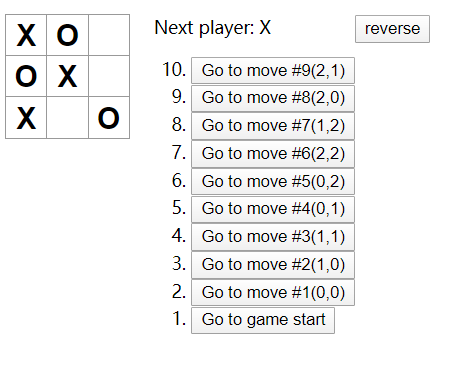
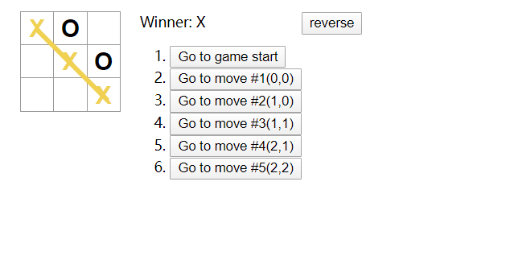
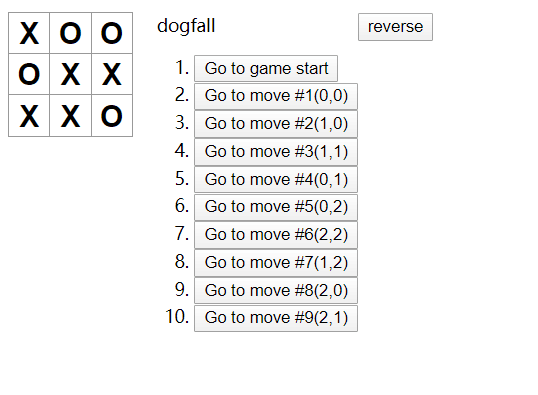

### 启动
npm start

### 在React教程的基础上，完成了性能优化部分

1、在游戏历史记录列表显示每一步棋的坐标，格式为 (列号, 行号)。  
2、 在历史记录列表中加粗显示当前选择的项目。  
3、 使用两个循环来渲染出棋盘的格子，而不是在代码里写死（hardcode）。  
4、添加一个可以升序或降序显示历史记录的按钮。  
5、每当有人获胜时，高亮显示连成一线的 3 颗棋子。  
6、当无人获胜时，显示一个平局的消息。  

### 最终效果图

### 踩坑笔记
1、`CRA(creat-react-app)` 如果电脑里之前使用过，再次使用的时候可能需要更新。  
2、单个文件太长时拆分成组件，别忘了export。  
  - 函数 `export default props =>{}`
  - 类 在文件末尾 `export default 类名`  

3、命名时要有意义且注意区分，有歧义的时候可太难了。  
4、对于需要在多个步骤保存的数据，保存在`state`中。  
5、`:hover` 选择器，用于选择鼠标指针浮动在上面的元素。  
6、react中的循环多用`map`，找到合适的数组进行遍历，写成双重遍历的形式又高效又简洁。此处就可以自己创建一个二维数组。  
7、js中的`reverse()`方法将数组中元素的位置颠倒，并返回该数组。数组的第一个元素会变成最后一个，数组的最后一个元素变成第一个。<b>该方法会改变原数组！！！</b>  
8、`<ol>`标签，顺序输出，`reversed = true/false`属性可以控制升序还是降序。  
9、`{winner && <Line winner={winner[1]}/>}`其中`&&`的用法表示在有winner时进行`<Line>`的渲染。  
10、react 的JSX语法真的非常好使。很多地方可以使用三目运算符。  
11、画线
  - 在棋盘同级`
`中新建一个线div设置`width=5px`(这个粗细可以根据个人喜好决定)，设置颜色、长度
  - 利用`calculateWinner()`函数返回获胜者符号、获胜的三个棋盘格子的编号。
  - 根据获胜格子的编号设置线div距离棋盘的top和left,注意，此时的`game-board`要设置为`position:relative`，因为不设置的情况下position默认为static。线设置为`position: absolute`，absolute属性生成绝对定位的元素，相对于 static 定位以外的第一个父元素进行定位。  
  - 根据获胜格子的编号计算线的长度和旋转角度。
    - `transform`旋转，`rotate`根据角度旋转，角度可以有多个单位次数使用red，通过Math.atan()可以获得旋转的弧度（如果是负45度就加上PI）。模板语法``rotate${}red``拼接字符串
    - `transformOrigin`定位旋转点，默认从中心点开始旋转
    - `(point =>{return;})(parameter)`立即执行函数
    - 根据坐标计算出线的长度。

12、react 的数组都需要一个key用来做区分。
